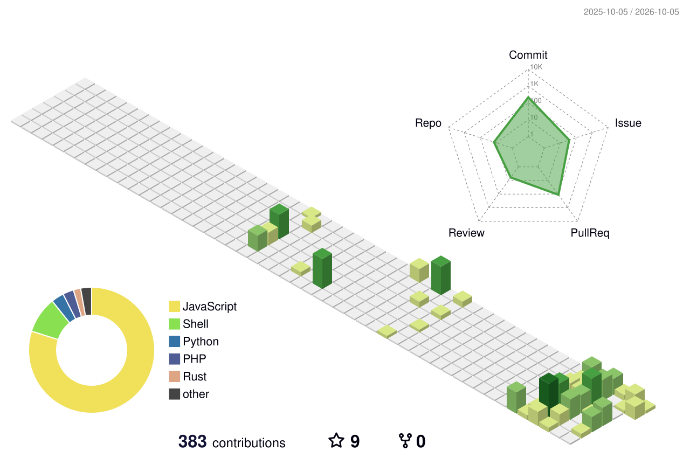

  

  
  
  
  
  

## 👋 About Me

茨城県立水戸第一高等学校の生徒。**第78回学苑祭「天翔る」では実行委員長**を務め、組織運営 × 技術演出の両輪でプロジェクトを推進しました（現在は次の代に引き継ぎ済み）。

技術で学校生活をアップデートすること、特に**校内DX・自動化**に情熱を注いでいます。ステージ演出技術はまだまだ勉強中です。

---

## 🔭 Current Focus

- **第78回 学苑祭「天翔る」**: 実行委員長として開催終了 ✅ 次の代に引き継ぎ済み
- **School Tech**: 「苑実ID」システムやデジタル生徒手帳の開発を通じた校内DX
- **Stage Tech (勉強中)**: MagicQ や Yamaha デジタルミキサーを触りながら、ステージ演出を勉強中

## 💬 Ask me about

- 校内イベントの企画・運営、技術的な自動化の実装
- Raspberry Pi / ESP32 を活用した IoT 工作
- GitHub を活用したチームでの開発管理

---

## 🛠 Tech Stack

  
  
  
  
  
  
  

---

## 🌤 Weather in Mito

<!-- Open-Meteo + .github/workflows/weather.yml が6時間ごとに自動更新 -->
<!-- WEATHER:START -->
**水戸市** — 🌤️ ほぼ晴れ（今日: ☁️ 曇り）

| 項目 | 値 |
|---|---|
| 🌡 気温 | 15.0℃（体感 15.2℃） |
| 💧 湿度 | 85% |
| 💨 風速 | 4.3 m/s |
| 📈 今日の最高 / 最低 | 20.8℃ / 14.5℃ |
| ☂ 降水確率 | 17% |
| 🕒 更新 | 10-04 06:29 JST |
<!-- WEATHER:END -->

---

## 📊 GitHub Stats

  
  
   
  
  
   
  

<!-- github-readme-stats は提供側503が続いているため summary-cards に切替中。復旧したら戻す

  
  

-->

<!-- 本家 (Ashutosh00710) は提供側402で停止中のためフォーク版を使用。復旧したら https://github-readme-activity-graph.vercel.app に戻す -->

<!-- trophy は提供側402で停止中のため一時コメントアウト。Vercelでのセルフホストで復活可

-->

---

## 🌱 Contributions

### 3D Contrib

### Snake

<picture>
  <source media="(prefers-color-scheme: dark)" srcset="https://raw.githubusercontent.com/Ryuto-dev/Ryuto-dev/output/github-snake-dark.svg" />
  <source media="(prefers-color-scheme: light)" srcset="https://raw.githubusercontent.com/Ryuto-dev/Ryuto-dev/output/github-snake.svg" />
  
</picture>

---

## 🌐 Portfolio

> 個人ポートフォリオサイトを準備中です。公開したらここにリンクを貼ります。

---

## 📫 How to reach me

- **X (Twitter)**: [@rumisassyu](https://x.com/rumisassyu)
- **Mail**: [asanuma.ryuto@gmail.com](mailto:asanuma.ryuto@gmail.com)

---

*⚡ Fun fact: 小学校5年生で第二種電気工事士の資格を取得しました。*

